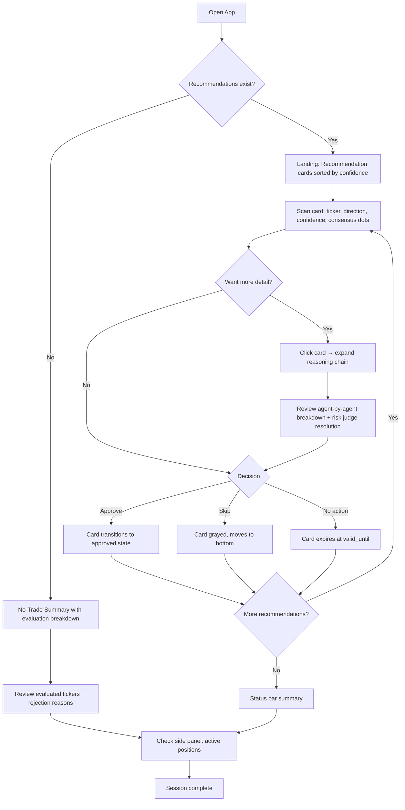
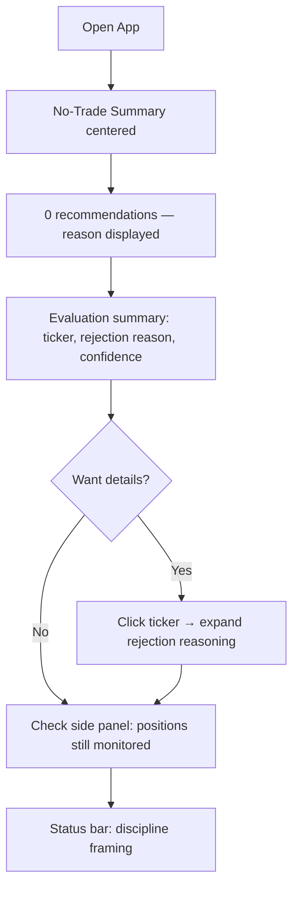
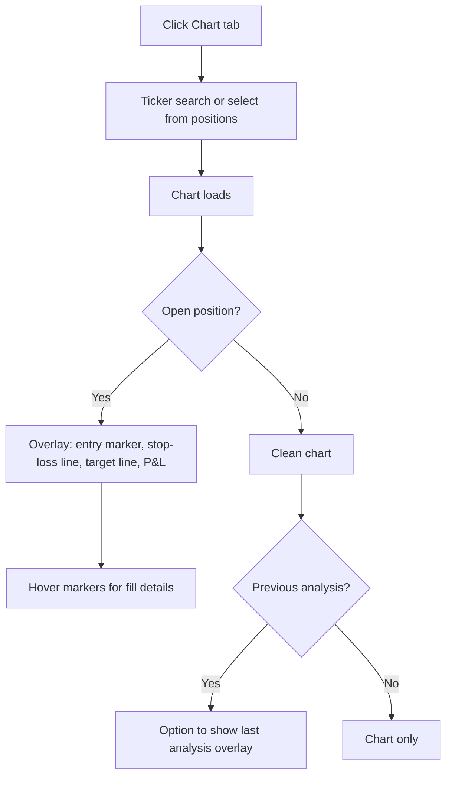
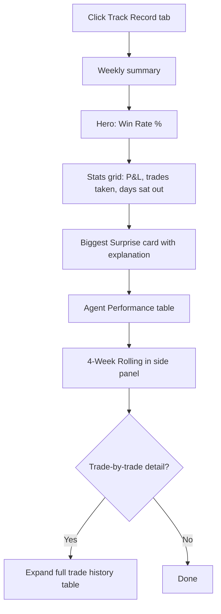

# UX Design Specification agents-for-trades

**Author:** Bok
**Date:** 2026-04-14

---

<!-- UX design content will be appended sequentially through collaborative workflow steps -->

## Executive Summary

### Project Vision

An autonomous trading system dashboard that presents AI-generated trade recommendations with full transparency into the reasoning behind each decision. The UX must bridge the gap between complex multi-agent analysis and clear, actionable trade information — enabling Bok to review, approve, and track trades with confidence. The interface should feel like a professional trading terminal: dense with information, dark-themed, and designed for quick decision-making in the pre-market window.

### Target Users

**Primary user: Bok** — solo developer and active options/equity trader. Checks the app pre-market (~8:30 AM ET) to review overnight recommendations, then periodically throughout the day to monitor positions. Values information density over visual simplicity. Wants to understand *why* the system recommends a trade, not just *what* it recommends. Intermediate technical skill — comfortable with complex dashboards but frustrated by cluttered or unclear layouts.

**Usage pattern:** Morning review session (5-10 minutes of focused attention), followed by brief check-ins during market hours. Desktop only for MVP.

### Key Design Challenges

1. **Trust through transparency** — The system makes autonomous trading decisions. Bok needs to see the reasoning chain (which agents agreed, which disagreed, what evidence drove the recommendation) at a glance, with the ability to drill deeper. Without this, the system is a black box he won't trust with real capital.

2. **Time-pressured decision making** — Pre-market review has a hard deadline (9:30 AM market open). The UI must surface the most critical information first: what to trade, at what price, with what risk. The `valid_until` countdown creates urgency that the interface must communicate without creating panic.

3. **Information density without clutter** — Bok wants Bloomberg-style density but the current UI feels "not clean enough." The challenge is presenting agent signals, trade specs, confidence scores, reasoning chains, and position status in a way that's dense but scannable — not just data dumped onto a screen.

4. **Two distinct interaction modes** — Morning review (decision mode: approve/reject/skip recommendations) vs. during-day monitoring (observation mode: check positions, see P&L, monitor stop-losses). The UI needs to serve both without requiring navigation between different screens.

### Design Opportunities

1. **Confidence-as-color** — Use confidence scores to drive visual hierarchy. High-confidence recommendations get prominent visual treatment; low-confidence or conflicting signals get muted presentation. This lets Bok scan and prioritize instantly.

2. **Agent disagreement as a feature** — When agents disagree, surface it visually (e.g., a dissent indicator). This is actually more trustworthy than unanimous agreement — it shows the system is thinking, not rubber-stamping.

3. **Progressive disclosure for reasoning** — Show the recommendation and key metrics at the top level. One click reveals the full reasoning chain with agent-by-agent breakdown. The user controls their depth of investigation.

4. **Weekly narrative, not just numbers** — The TrackRecordScreen "aha moment" can be more than a table. Trend visualization, strategy attribution, and "biggest surprise" callouts turn a P&L report into a learning tool.

## Core User Experience

### Defining Experience

The core interaction is a **30-second recommendation scan**: open the app pre-market, see what the agents found overnight, understand why in 2-3 glances, and approve or skip. Every design decision serves this loop. Secondary interaction: pull up a ticker with an open position and see the trade signals overlaid on the chart — entry, stop-loss, target, current price — without navigating away from the chart view.

### Platform Strategy

- **Desktop only** for MVP — mouse/keyboard interaction, no touch optimization needed
- **Web application** served via FastAPI + Vite — existing architecture preserved
- **No offline requirement** — system requires live market data and API connectivity
- **Dark mode** as the default and only theme for MVP
- **Minimum viewport:** 1280px width — designed for full desktop screens, not cramped laptop windows

### Effortless Interactions

1. **App open → recommendations visible** — no clicks to get to the morning's recommendations. They're the landing state
2. **Recommendation → full context** — one click expands reasoning chain. No page navigation, no modal hell
3. **Approve/skip** — single action per recommendation. Not a form, not a confirmation dialog — one gesture
4. **Ticker search → chart with signals** — search a ticker with an open trade and immediately see entry point, stop-loss, profit target, and current P&L overlaid on the price chart
5. **Pipeline runs without intervention** — analysis triggers on schedule, results appear when ready. No manual "run" button needed for the happy path (manual trigger available as fallback)

### Critical Success Moments

1. **"This is how I would have traded"** — the first time Bok sees a recommendation with the exact strike, expiry, entry, stop, and target he would have chosen himself, backed by a reasoning chain that mirrors his own analysis process. This is the moment trust is established
2. **"The system protected me"** — the first time the system sits out a volatile day with a clear no-trade explanation. Seeing capital preserved by intelligent inaction builds deeper trust than any winning trade
3. **"I can see what happened"** — the Friday weekly summary showing win rate, P&L attribution by strategy/agent, and honest explanations of losses. Transparency in failure builds more trust than hiding behind aggregate numbers
4. **"I can see the trade on my chart"** — pulling up a ticker and seeing the complete trade visualization — entry marker, stop-loss line, target line, current position P&L — without any additional navigation

### Experience Principles

1. **Information-dense, not decoration-dense** — every pixel earns its space with data, not padding. Tight spacing, compact typography, minimal borders. Professional terminal aesthetic, not consumer app aesthetic
2. **Glanceable then drillable** — top level shows the decision (trade/no-trade, confidence, key metric). One interaction reveals the full reasoning. Never force depth before the user asks for it
3. **Trust through transparency** — always show the reasoning, always show the disagreements, always show the confidence level. A transparent wrong call builds more trust than an opaque right one
4. **Urgency without anxiety** — `valid_until` countdowns and pre-market deadlines create time pressure. The UI communicates urgency through clear visual hierarchy, not flashing alerts or red warnings

## Desired Emotional Response

### Primary Emotional Goals

**Quiet confidence** — The system earns trust not through flashy wins but through consistent, well-reasoned decisions. When a trade works, the feeling is "of course" — the analysis was thorough, the reasoning was sound, the outcome was expected. No celebration UI, no confetti. Just a calm acknowledgment that the system did its job.

**Intellectual partnership** — The system feels like a sharp colleague who shows their work. Not a black box giving orders, not a subordinate asking for permission — a peer who says "here's what I found, here's what I think, here's why." Bok's role is to evaluate and decide, not to blindly follow or micromanage.

### Emotional Journey Mapping

| Moment | Target Emotion | Design Implication |
|--------|---------------|-------------------|
| App open, pre-market | Calm readiness | Clean landing state, no alarms, recommendations presented matter-of-factly |
| Reviewing a recommendation | Informed confidence | Reasoning chain visible, confidence level clear, agent consensus/dissent shown |
| Approving a trade | Decisive clarity | Single action, no second-guessing prompts, no "are you sure?" |
| System sits out | Reassured trust | Clear explanation, no sense of missed opportunity — "we chose not to trade" framed as an active decision |
| Checking positions during day | Relaxed awareness | P&L visible at a glance, stop-losses in place, nothing demanding attention unless something needs it |
| Trade hits stop-loss | Analytical acceptance | "Here's what happened and why" — not an alarm, but a debrief. Loss was within guardrails |
| Friday performance review | Earned satisfaction | Win rate, attribution, honest accounting. The system is transparent about both wins and losses |
| No recommendations for the day | Patience, not FOMO | "No opportunities met your criteria today" framed as discipline, not failure. Show what was evaluated and why it was rejected |

### Micro-Emotions

**Cultivate:**
- **Confidence** over confusion — every screen answers "what should I know?" before the user asks
- **Trust** over skepticism — show the work, show the disagreements, show the confidence level
- **Calm focus** over anxiety — no red flashing alerts, no urgent notifications unless positions are at risk
- **Discipline** over FOMO — when the system doesn't trade, explicitly show what was considered and why it was rejected. "We looked at 12 tickers and none met the criteria" is better than showing nothing

**Prevent:**
- **FOMO** — the biggest emotional risk. If the system passes on a trade that would have won, the UI must not retroactively highlight the miss. No "you could have made $X" guilt
- **Anxiety** — no countdown timers that feel like bombs. `valid_until` should communicate "you have time" not "time is running out"
- **Overwhelm** — information density must be structured, not dumped. Dense is good; chaotic is not
- **Distrust** — never hide bad outcomes. A loss shown honestly builds more trust than a loss buried in aggregate stats

### Design Implications

| Emotion | UX Approach |
|---------|------------|
| Quiet confidence | Muted color palette, no celebration animations. Green for wins is subtle (text color, not background). Success is stated, not performed |
| Intellectual partnership | Reasoning chain always accessible. Agent signals shown as peer opinions, not authority commands. "Fundamentals analyst sees..." not "SYSTEM ALERT:" |
| No FOMO | When system passes, show the evaluation summary: "Analyzed 8 tickers, 0 met confidence threshold." No retroactive "what if" displays |
| Analytical acceptance of loss | Loss debrief card shows: what happened, which guardrail was hit, what the agents saw vs. what actually happened. Framed as learning, not failure |
| Calm readiness | Status bar shows system health (last run time, next scheduled run, positions monitored) without demanding attention |

### Emotional Design Principles

1. **State, don't celebrate** — wins are reported factually. "AAPL +12.3%, target hit." No fireworks, no streaks, no gamification. Professional tool, not a trading game
2. **Explain, don't excuse** — losses get the same reasoning depth as wins. Show what the agents saw, what the risk judge decided, what actually happened. No defensive language
3. **Discipline is a feature** — passing on trades is framed as the system working correctly, not as a missed opportunity. Show the work that went into the "no trade" decision
4. **Availability, not urgency** — information is always accessible but never demands attention unprompted. The user pulls information when ready; the system doesn't push panic

## UX Pattern Analysis & Inspiration

### Inspiring Products Analysis

**TradingView**
- Chart is the hero — everything else serves it. Toolbars compact, stay out of the way. Dark mode feels native. Layered information on a single canvas — price data, indicators, drawings coexist without competing
- Relevant: chart overlay pattern (entry markers, stop-loss lines, target lines) should follow TradingView's approach — clean lines, subtle colors, labels on hover

**iOS Design System (Apple HIG)**
- Restraint. Typography hierarchy does the heavy lifting. Content grouped by proximity and weight, not by containers. Minimal borders, boxes, and dividers
- Relevant: addresses the "too bubbly" problem — strip card borders, reduce border-radius, let spacing and typography create structure

**Supabase Dashboard**
- Developer-oriented dark mode done right. Muted backgrounds (not pure black), accent colors used sparingly for status. Monospace for data, sans-serif for labels. Tables are scannable. Flat, direct navigation
- Relevant: color discipline maps to confidence-as-color. Functional color only — never decorative

### Transferable UX Patterns

**From TradingView:**
- Chart-centric layout with trade signals as overlays
- Compact toolbar for actions (icon-driven, not big buttons)
- Watchlist as slim side panel
- Tooltip-on-hover for detail rather than permanent labels

**From iOS:**
- Typography-driven hierarchy — size and weight, not boxing
- Spacing as structure — group by proximity, not containers
- Minimal border-radius (2-4px), not bubbly 12-16px rounded cards
- Smooth, subtle state transitions

**From Supabase:**
- Semantic color system — each color has defined meaning across entire UI
- Monospace for data values, sans-serif for labels
- Compact table design — left-aligned text, right-aligned numbers
- Flat navigation — no nested dropdowns, tabs visible and direct

### Anti-Patterns to Avoid

1. **Gamification** — no confetti, streaks, achievement badges
2. **Excessive card UI** — wrapping every element in rounded cards with shadows creates the bubbly feel
3. **Alert overload** — no toast stacking, no badge counts, no red dots
4. **Pure black backgrounds** — use dark grays (~#1c1c1c to #232323) for softer professional feel
5. **Decorative color** — no gradients, no colorful section headers, no brand splashes

### Design Inspiration Strategy

**Adopt:**
- TradingView chart overlay pattern for trade signals
- Supabase semantic color system (green/amber/red/blue + neutrals)
- iOS typography hierarchy (weight and size, not boxes)
- Supabase dark mode palette (dark gray, not pure black)
- Compact icon-driven action buttons (TradingView toolbar style)

**Adapt:**
- TradingView watchlist panel → recommendation panel (slim sidebar with confidence indicators)
- Supabase table design → trade history and performance tables
- iOS spacing rhythm → tighter for information density, but still rhythmic

**Avoid:**
- Rounded card containers with shadows
- Decorative color or gradients
- Gamification elements
- Alert/notification stacking
- Pure black backgrounds

## Design System Foundation

### Design System Choice

**Tailwind CSS v4 (utility-first, no component library)** — custom design system built on Tailwind's utility framework with semantic design tokens.

### Rationale for Selection

- Already established in the codebase — no migration needed
- Full control over every visual decision — no fighting library defaults
- Eliminates the "bubbly" aesthetic that component libraries impose
- Lightweight Charts (TradingView's library) already integrated for charting
- Single-user tool with ~15 custom components — component library is unnecessary overhead
- Tailwind's dark mode utilities are first-class

### Implementation Approach

1. **Design tokens in Tailwind config** — semantic color palette, spacing scale, typography scale as CSS custom properties
2. **Small component library** — 10-15 project-specific components built with Tailwind utilities
3. **No external component library** — all components custom, purpose-built
4. **Lightweight Charts** continues as charting foundation

### Customization Strategy

**Color Tokens (Supabase-inspired semantic palette):**
- `--bg-primary`: dark gray (~#1c1c1c), not pure black
- `--bg-secondary`: slightly lighter (~#232323) for panels/sections
- `--bg-elevated`: card/overlay background (~#2a2a2a)
- `--text-primary`: off-white (~#e0e0e0)
- `--text-secondary`: muted (~#888888)
- `--accent-green`: success/bullish (~#3ecf8e, Supabase green)
- `--accent-red`: error/bearish (~#f56565)
- `--accent-amber`: warning/caution (~#eab308)
- `--accent-blue`: interactive/info (~#3b82f6)

**Typography:**
- Data values: `font-mono` (prices, percentages, timestamps, confidence scores)
- Labels/descriptions: `font-sans` (Inter or system sans-serif)
- Hierarchy through weight and size only — no boxing

**Spacing:**
- Base unit: 4px
- Tight rhythm: 4, 8, 12, 16, 24, 32px
- Denser than default Tailwind for terminal aesthetic

**Border radius:**
- Default: 2px (barely perceptible rounding)
- Buttons/inputs: 4px
- No large rounded corners anywhere

## Core User Experience Detail

### Defining Experience

**"Review and act on AI-generated trade recommendations in under 30 seconds each."**

The system does the analysis overnight. Bok's job is evaluation and judgment — scan the recommendation, assess the reasoning, decide. The interface must make this feel like reading a well-prepared brief, not like operating a complex tool.

### User Mental Model

Bok thinks of the system as a **trading desk analyst** — it does the research, prepares the pitch, and presents it for approval. The mental model is not "I'm using a tool" but "I'm reviewing someone's work." This means:

- Recommendations should read like analyst notes, not form outputs
- Agent signals should feel like peer opinions ("Fundamentals sees strong earnings momentum") not system alerts
- The approve/skip action should feel like giving a go/no-go to a colleague

### Success Criteria

1. Bok can assess a recommendation's merit in under 30 seconds without expanding anything
2. One click reveals the full reasoning chain if he wants deeper
3. Approve or skip is a single action with no confirmation dialogs
4. After acting on all recommendations, switch to chart view — total session under 5 minutes
5. Returning during the day shows position status at a glance without re-entering context

### Novel UX Patterns

**Recommendation card with embedded consensus indicator:**
Compact card showing ticker, direction, confidence, trade spec, and agent agreement visual (e.g., 4/5 bullish, 1 dissent). Gives instant trust calibration: unanimous = straightforward, dissent = worth investigating.

**Time-bound approval with passive expiry:**
Each recommendation has `valid_until` displayed as remaining time. If Bok doesn't act, the recommendation expires — no explicit rejection needed. Removes pressure of explicit rejection; focus on what to approve, let the rest expire.

**No-trade summary as active decision:**
When system finds no opportunities: "Evaluated 12 tickers — 0 met criteria" with collapsible breakdown. Frames inaction as deliberate, reasoned decision — not empty state.

### Experience Mechanics

**1. Initiation — App Open (Landing State)**

| Element | Content |
|---------|---------|
| Header bar | System status: last run time, next run, positions monitored |
| Primary area | Recommendation cards (if any) or no-trade summary |
| Side panel | Active positions with P&L at a glance |

No navigation needed. Landing state IS the morning review. Recommendations sorted by confidence (highest first).

**2. Interaction — Recommendation Scan**

For each recommendation card:
- **Visible at a glance:** Ticker, direction (BUY/SELL), trade type, confidence score, strategy name, valid_until countdown
- **Key metrics:** Entry price, stop-loss, target, position size, risk/reward ratio
- **Consensus indicator:** Agent agreement visual (colored dots — green bullish, red bearish, gray neutral)
- **One-click expand:** Full reasoning chain — agent-by-agent breakdown with evidence and dissent

**3. Feedback — Decision Actions**

- **Approve:** Single click/keyboard shortcut. Card transitions to "approved" state. Trade queued
- **Skip:** Single click or let expire. No negative connotation
- **Expand reasoning:** Click card body to toggle reasoning chain. Non-destructive

**4. Completion — Session End**

- Approved trades show as "queued" in side panel
- Switch to chart view for any ticker — trade signals overlaid
- Status bar: "3 approved, 1 skipped, 2 expired"
- No explicit "done" action — stop interacting, check back later

## Visual Design Foundation

### Color System

**Dark mode palette (Supabase-inspired):**

| Token | Value | Usage |
|-------|-------|-------|
| `--bg-base` | `#131313` | App background |
| `--bg-primary` | `#1c1c1c` | Primary surface (main content area) |
| `--bg-secondary` | `#232323` | Secondary surface (panels, sidebars) |
| `--bg-elevated` | `#2a2a2a` | Elevated elements (expanded cards, dropdowns) |
| `--bg-hover` | `#333333` | Hover state for interactive elements |
| `--border-subtle` | `#2e2e2e` | Subtle dividers between sections |
| `--border-default` | `#3a3a3a` | Default borders on inputs, cards |
| `--text-primary` | `#e0e0e0` | Primary text |
| `--text-secondary` | `#888888` | Labels, descriptions, timestamps |
| `--text-tertiary` | `#555555` | Disabled, placeholder text |

**Semantic accent colors (functional only — never decorative):**

| Token | Value | Meaning |
|-------|-------|---------|
| `--accent-green` | `#3ecf8e` | Bullish, win, success, profit |
| `--accent-red` | `#f56565` | Bearish, loss, error, stop-loss hit |
| `--accent-amber` | `#eab308` | Caution, low confidence, expiring soon |
| `--accent-blue` | `#3b82f6` | Interactive, info, links, active state |

**Color usage rules:**
- Green/red used for text color on data values, never as background fills
- Amber for `valid_until` warnings when under 30 minutes remaining
- Blue for clickable elements and active states only
- No color gradients anywhere
- Confidence levels use opacity of green (high = full, low = faded)

### Typography System

**Font Stack:**
- **Sans-serif:** Inter, system-ui, -apple-system, sans-serif
- **Monospace:** JetBrains Mono, Fira Code, ui-monospace, monospace

**Type Scale:**

| Level | Size | Weight | Font | Usage |
|-------|------|--------|------|-------|
| Page title | 18px | 600 | Sans | Screen headers only |
| Section header | 14px | 600 | Sans | Panel titles, section labels |
| Body | 13px | 400 | Sans | Descriptions, reasoning text |
| Label | 11px | 500 | Sans | Field labels, timestamps, metadata |
| Data large | 16px | 500 | Mono | Primary data (ticker, confidence) |
| Data default | 13px | 400 | Mono | Prices, percentages, P&L |
| Data small | 11px | 400 | Mono | Secondary data, table cells |

**Typography rules:**
- No font size larger than 18px
- Weight and size create hierarchy — never color for emphasis
- Monospace for ANY numeric value
- Sans-serif for ANY descriptive text
- Line height: 1.4 body, 1.2 data values

### Spacing & Layout Foundation

**Spacing Scale:**

| Token | Value | Usage |
|-------|-------|-------|
| `--space-1` | 4px | Inline padding, icon-to-text gap |
| `--space-2` | 8px | Between related items |
| `--space-3` | 12px | Between elements in a group |
| `--space-4` | 16px | Between sections within a panel |
| `--space-6` | 24px | Between major sections |
| `--space-8` | 32px | Panel padding, major separations |

**Layout Structure:**

```
┌─────────────────────────────────────────────────────┐
│ Header Bar (40px) — status, last run, nav tabs      │
├──────────────────────────────┬──────────────────────┤
│                              │                      │
│  Primary Content Area        │  Side Panel (320px)  │
│  (flexible width)            │                      │
│                              │  - Active positions  │
│  - Recommendations           │  - Quick stats       │
│  - Chart view                │  - Config access     │
│  - Track record              │                      │
│                              │                      │
├──────────────────────────────┴──────────────────────┤
│ Status Bar (28px) — session summary, system health  │
└─────────────────────────────────────────────────────┘
```

- Header: 40px, compact, tab navigation (Recommendations | Chart | Track Record)
- Side panel: Fixed 320px, always visible. Active positions, quick stats
- Primary area: Flexible width, content changes by tab
- Status bar: 28px bottom. Session summary, system health
- Panels separated by 1px `--border-subtle` lines, not gaps or shadows
- No drop shadows — flat, clean separation
- Compact table rows: 32px height
- No horizontal scrolling

### Accessibility Considerations

- All text meets WCAG AA contrast minimum (text-primary on bg-primary = 11.3:1)
- Color never the only indicator — text labels alongside color (BUY/SELL, WIN/LOSS)
- Keyboard shortcuts for approve/skip actions
- Visible focus rings using `--accent-blue` outline
- Minimum font size: 11px

## Design Direction Decision

### Design Directions Explored

Six directions explored covering recommendation layouts (Dense Terminal, Border Accent, Table-First), empty states (No-Trade), weekly review, and reasoning chain depth. Interactive HTML showcase at `ux-design-directions.html`.

### Chosen Direction

**Direction A (Dense Terminal)** as base — recommendation cards with specs grid, consensus dots, inline actions. **BUY/SELL word carries the accent color** (green text for BUY, red for SELL) — no left border accent.

**Key elements:**
- Recommendation cards: ticker, direction badge (colored text), strategy, consensus dots, confidence, valid_until
- Trade specs grid: entry, stop, target, size, R:R — visible without expanding
- Approve/Skip as compact inline actions
- One-click expand for reasoning chain
- No-trade state: discipline framing with evaluation summary
- Weekly review: win rate hero, P&L, attribution, biggest surprise, agent performance
- Side panel: active positions, quick stats

### Design Rationale

- Dense Terminal gives most information per card — supports 30-second scan
- Colored text badges subtler than border accents — convey direction without visual weight
- Consensus dots provide instant trust calibration
- No-trade state as active decision prevents FOMO

### Implementation Approach

- Refactor existing components to match design tokens
- New components: RecommendationCard, ConsensusIndicator, ReasoningChain, NoTradeSummary, WeeklySummary
- Extend existing: TradeSidebar (approval), TrackRecordScreen (weekly), ReportPane (reasoning)
- All Tailwind utility classes with design tokens

## User Journey Flows

### Journey 1: Morning Pre-Market Review



**Key interactions:**
- Entry: app open = landing state, no navigation needed
- Scan: 30 seconds per card — ticker, direction (colored text), confidence, consensus dots
- Decide: Approve (`A` key) or Skip (`S` key). No confirmation dialog
- Expand: click card body for reasoning chain. Non-destructive
- Exit: no explicit end. Status bar summarizes session

### Journey 2: System Sits Out (No-Trade Day)



**Key interactions:**
- No empty state — content-rich no-trade view
- Evaluation summary shows every ticker considered with rejection reason
- Framing: "0 met criteria" not "0 found"
- Side panel still shows active positions

### Journey 3: Check Position on Chart



**Key interactions:**
- Search or click position in side panel → chart loads with overlays
- TradingView-style markers: entry as horizontal marker, stop/target as dashed lines
- Hover for detail: fill price, time, order ID

### Journey 4: Friday Weekly Review



**Key interactions:**
- Win rate hero number — first thing visible
- Biggest surprise: high-confidence miss with honest explanation
- Agent performance: accuracy, contribution notes
- Progressive disclosure: summary first, detail on expand

### Journey Patterns

- **Navigation:** Tab-based (Recommendations | Chart | Track Record). Side panel persistent across tabs
- **Decision:** Single-action approve/skip. No confirmation dialogs. Passive expiry valid
- **Feedback:** Subtle state changes (color shift, position). Status bar for session summary
- **Information density:** Glanceable → one-click detail → full reasoning. Three levels, user-controlled

### Flow Optimization Principles

1. **Zero clicks to value** — recommendations visible on app open
2. **Keyboard-first** — `A` approve, `S` skip, `Tab` next card, `Enter` expand, `1/2/3` switch tabs
3. **No modal interruptions** — everything inline
4. **Side panel as persistent context** — positions and stats always visible
5. **Passive actions valid** — letting recommendations expire is fine, no guilt

## Component Strategy

### Existing Components (Preserve & Restyle)

| Component | Current Role | Restyle Needed |
|-----------|-------------|----------------|
| ChartContainer | Lightweight Charts wrapper | Dark theme tokens, overlay support |
| ChartScreen | Chart view layout | Tab integration |
| TradeSidebar | Trade execution panel | Becomes approval interface |
| TrackRecordScreen | Performance view | Weekly summary redesign |
| ConfigSidebar | Settings panel | Config API integration |
| ReportPane / ReportTabs | Analysis reports | Reasoning chain integration |
| ProgressStepper | Pipeline progress | ETR display, cancel support |
| ScoringCard / CalibrationChart | Scoring display | Token restyle |
| TickerAutocomplete | Ticker search | Token restyle |
| GlobalStatusBar | Status display | Redesign as 28px compact bar |

### Custom Components

#### RecommendationCard
**Purpose:** Core interaction — displays trade recommendation for review
**Content:** Ticker, direction badge (colored text), strategy, consensus dots, confidence, valid_until, trade specs grid
**Actions:** Approve (`A`), Skip (`S`), Expand reasoning (click body)
**States:** `pending_review` (default), `approved` (green tint), `skipped` (grayed), `expired` (faded)

#### ConsensusIndicator
**Purpose:** Agent agreement visualization
**Content:** 4-5 colored dots (green=bullish, red=bearish, gray=neutral)
**Variants:** Compact (dots only) and expanded (dots + agent names)
**Accessibility:** Tooltip: "4 of 5 agents bullish, 1 neutral"

#### ReasoningChain
**Purpose:** Expandable agent-by-agent breakdown
**Content:** Per agent: name, signal + confidence, evidence. Risk judge resolution at bottom
**Interaction:** Inline expand/collapse on card click. Dissenting agents highlighted amber

#### TradeSpecGrid
**Purpose:** Compact trade specifications display
**Content:** 5-column grid: Entry, Stop, Target, Size, R:R
**Variants:** Full (RecommendationCard) and compact (PositionCard)

#### ValidUntilBadge
**Purpose:** Remaining time countdown
**States:** Normal (>30min, secondary), warning (<30min, amber), urgent (<10min, amber pulse), expired (tertiary)

#### NoTradeSummary
**Purpose:** Content-rich no-recommendation display
**Content:** "0 recommendations" headline, reason, evaluation summary table

#### EvaluationTable
**Purpose:** Rejected tickers with reasons
**Content:** Ticker, rejection reason, confidence score. Rows expandable

#### WeeklySummaryHero
**Purpose:** Friday "aha moment" — hero win rate + stats
**Content:** Win rate (large), P&L, trades taken, days sat out, avg winner/loser, profit factor

#### BiggestSurprise
**Purpose:** Most important weekly learning
**Content:** Ticker, outcome, confidence at prediction time, honest explanation

#### AgentPerformanceTable
**Purpose:** Agent accuracy tracking
**Content:** Agent name, accuracy %, avg confidence, contribution note

#### PositionCard
**Purpose:** Compact open position display in side panel
**Content:** Ticker, direction, P&L (colored), entry, current, stop-loss
**Interaction:** Click navigates to Chart tab with this ticker

#### QuickStats
**Purpose:** Always-visible summary stats in side panel
**Content:** Win rate, open positions, week P&L, expectancy — 2x2 grid

### Component Composition

```
RecommendationCard
├── ConsensusIndicator
├── TradeSpecGrid
├── ValidUntilBadge
├── ReasoningChain (expandable)
└── Action buttons (Approve / Skip)

Side Panel
├── PositionCard (per position)
└── QuickStats

NoTradeSummary
└── EvaluationTable

WeeklySummaryHero
├── BiggestSurprise
└── AgentPerformanceTable
```

### Implementation Roadmap

**Phase 1 — Core (morning review):**
1. RecommendationCard + TradeSpecGrid + ConsensusIndicator + ValidUntilBadge
2. PositionCard + QuickStats (side panel)
3. GlobalStatusBar redesign
4. Restyle existing components with design tokens

**Phase 2 — Depth (trust-building):**
5. ReasoningChain
6. NoTradeSummary + EvaluationTable
7. PositionOverlay on ChartContainer

**Phase 3 — Review (weekly loop):**
8. WeeklySummaryHero + BiggestSurprise + AgentPerformanceTable
9. TrackRecordScreen redesign

## UX Consistency Patterns

### Action Hierarchy

**Primary actions** (Approve trade): Green text + 1px green border. Compact: 4px 12px padding, 11px font. Hover: green bg at 10% opacity. Max one primary action per context.

**Secondary actions** (Skip, Expand): `--text-secondary`, `--border-default`. Hover: `--bg-hover`, text brightens.

**Destructive actions** (Close position): Red text + 1px red border. Single click for paper trading; confirmation required for live trading (Phase 3).

**Keyboard shortcuts:** Shown as hints next to labels. Single keys: `A` approve, `S` skip, `Enter` expand, `Esc` collapse, `1/2/3` tabs.

### Feedback Patterns

No toasts, no modals, no stacking notifications. Feedback is inline and contextual.

| Feedback Type | Pattern | Example |
|--------------|---------|---------|
| Action confirmation | Inline state change | Card shifts to approved (green tint) |
| Pipeline progress | ProgressStepper with ETR | "Fundamentals... ~2 min remaining" |
| Error | Inline text below element | "Alpaca connection failed" |
| System status | Status bar (28px bottom) | "Pipeline: completed 07:45 AM" |
| Data update | Value fade transition | P&L updates with 200ms fade |

No sound. No browser notifications. No badges. Pull-based interface.

### Loading & Empty States

**Loading:** Skeleton placeholders matching expected content shape. No spinners. Status bar: "Pipeline running... ~3 min remaining"

**Empty states:** Single line text-secondary: "No open positions" / "No closed trades yet". No illustrations, no icons. Text only.

**No-trade is NOT an empty state** — it's content-rich (NoTradeSummary component).

### Data Display Patterns

**Numbers:** All monospace. Positive: green. Negative: red. Neutral: text-primary. Always include sign (+/-) and symbol ($). Right-align in tables.

**Tables:** 32px rows. Left-align text, right-align numbers. Header: 10px uppercase, text-tertiary, 0.5px letter-spacing. Row dividers: 1px border-subtle. Hover: bg-hover. No alternating rows.

**Timestamps:** Relative when recent ("47 min left"). Absolute when historical ("Apr 11, 07:45 AM"). text-secondary, monospace.

### Navigation Patterns

**Tabs:** Recommendations | Chart | Track Record. Active: text-primary + 2px accent-blue bottom border. Keyboard: `1/2/3`.

**Side panel:** Always visible, 320px fixed. Content contextual by tab, always shows positions. No collapse toggle.

**No breadcrumbs, no back buttons, no nested navigation.**

### Transition & Animation Patterns

| Element | Animation | Duration |
|---------|-----------|----------|
| Card expand/collapse | Height transition | 150ms ease-out |
| Tab switch | Instant, no animation | 0ms |
| Data value update | Opacity fade | 200ms |
| Card state change | Background color | 200ms |
| Hover states | Background/color | 100ms |

No entrance animations. Content appears instantly. No slide-in, no fade-in.

## Responsive Design & Accessibility

### Responsive Strategy

Desktop only for MVP. No tablet or mobile layouts.

- **Minimum viewport:** 1280px width
- **Optimal viewport:** 1920px — extra width goes to primary content area
- No fluid scaling below 1280px — horizontal scroll acceptable

### Breakpoint Strategy

| Breakpoint | Layout |
|-----------|--------|
| ≥1280px | Standard: header + primary + side panel (320px) + status bar |
| ≥1600px | Same layout, wider primary area. 2-column recommendations if >4 cards |

No mobile or tablet breakpoints.

### Accessibility Strategy

**Target: WCAG AA** — for user efficiency, not legal compliance.

- Contrast: text-primary on bg-primary = 11.3:1 (exceeds AA)
- Color never sole indicator — text labels alongside color
- Keyboard shortcuts for all primary actions
- Focus rings using accent-blue
- Tab order follows visual layout: header → primary content → side panel
- ARIA labels on consensus dots, chart overlays, status bar
- Screen reader: cards announce as "[Ticker] [Direction] [Confidence]% confidence"
- No flashing content, no auto-playing media

### Testing Strategy

- Chrome (primary) and Firefox (secondary)
- Keyboard-only navigation test for morning review flow
- Contrast verified by design token choices

### Implementation Guidelines

- Tailwind responsive prefixes only for ≥1600px (`2xl:`)
- CSS Grid/Flexbox — no absolute positioning except chart overlays
- Side panel `fixed` width, primary area `flex-1`
- Font sizes in `px` — exact pixel control for density
- Touch targets not relevant — mouse/keyboard only
